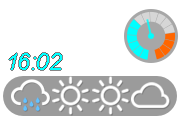
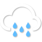

[English](README.md)| [中文](README_zh.md)

# Weather Widget
This weather widget with zelda BotW style is a set of [Rainmeter](https://docs.rainmeter.net/) skin. <br/>


<br/>

The weather icons show the current weather and forecast for next 3 days.<br/>

The data is from [Ventusky](https://www.ventusky.com/)

## Usage

**This skin needs Internet connection.**

### Load Skin
Put `Ventusky_with_baiduIcon` in your themes folder. <br/>

Refresh the Rainmeter themes. Use `Ventusky_with_baiduIcon\webweather_ventusky_4_day.ini` to load the skin.

### Choose location

Open `webweather_ventusky_4_day.ini` file, find the section
```ini
[Variables]
;{location} change to your location
Url_weather=https://www.ventusky.com/{location}
```
Change the `{location}` part to your city, like `new-york`:

```ini
Url_weather=https://www.ventusky.com/new-york
```

Some city name may need longtitude and latitude (or other arguments) because of the Duplicate name like Peterborough in England and Canada:

```ini
; Peterborough in Canada
Url_weather=https://www.ventusky.com/peterborough;44.3;-78.33
; Peterborough in England
Url_weather=https://www.ventusky.com/peterborough
```
Use coordinates(longtitude and latitude) directly:

```ini
; somewhere in Alaska
Url_weather=https://www.ventusky.com/62.283;-155.028
```

Visit [Ventusky](https://www.ventusky.com/) and find your city on map then click it, you can check the web-url if you don't know exactly how your city name or data is stored on the website.
## Weather

### Legends

| Legends | | | |
|-|-|-|-|
|||||
|Sunny|Little Cloudy|Cloudy|Fog|
|||||
|Cloudy & Rain|Middle Rain|Heavy Rain|Lightning rain|
| ||||
| |Sleet|Snow|Hail|
|||||
|Lightning|Drizzle|Cirrus Cloud|Little Rain|


## The Termometer

### Thermometer scale


<br/>


<br/>

### Thermometer not working

If the Thermometer always lays on 0, try to change the other regular expression here:

```ini
[Variables]

 ....
 
;Thermometer not moving?
;If the temperature information cannot loaded, try the other regular expression
Reg_Exp_tmp=(?s)<td\s+class="temperature">\s+((\-)?\d+(\.\d+)?)
;Reg_Exp_tmp=(?s)<b\s+class="teplota">\s*((\-)?\d+(\.\d+)?)

```

This is because some of the cities don't have actual information panel.
The second regular expression can also be used when you want to use coordinates(longtitude and latitude) directly.


# Donation
Wish you enjoy this work. 
It will be a greet help when you can make a donation:<br/>
<a href='https://Ko-fi.com/ztbxxt'></a>
<a href='https://paypal.me/ztbxxt'></a>
<a href='https://afdian.net/@ztbxxt'></a>
