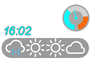
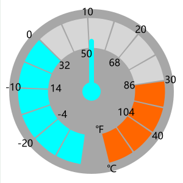

[English](README.md)| [中文](README_zh.md)

# 天气小皮肤
仿照塞尔达荒野之息的天气显示方法制作的[Rainmeter](https://docs.rainmeter.net/) 天气预报小工具。 <br/>


<br/>

能显示当前天气和未来三天的预报。<br/>

预报数据来自 [Ventusky](https://www.ventusky.com/)

## 使用方法

**本工具需要联网使用。**

### 加载皮肤
把 `Ventusky_with_baiduIcon` 放到你的皮肤文件夹。 <br/>

Rainmeter刷新所有皮肤，找到`Ventusky_with_baiduIcon\webweather_ventusky_4_day.ini`加载。

### 选择城市位置

打开配置文件`webweather_ventusky_4_day.ini`, 找到这一段：
```ini
[Variables]
;{location} change to your location
Url_weather=https://www.ventusky.com/{location}
```

把`{location}`改成你的城市位置，比如 `new-york`：

```ini
Url_weather=https://www.ventusky.com/new-york
```

某些城市由于重名问题，网站存储的时候附加了信息（比如经纬度），这些信息也要写道Url中。<br/>
比如加拿大和英国的Peterborough表示方法不同：
```ini
; Peterborough in Canada
Url_weather=https://www.ventusky.com/peterborough;44.3;-78.33
; Peterborough in England
Url_weather=https://www.ventusky.com/peterborough
```
有些城市网站并未收录，但是有气象信息，可以直接使用经纬度：

```ini
; somewhere in Alaska
Url_weather=https://www.ventusky.com/62.283;-155.028
```

到 [Ventusky](https://www.ventusky.com/) 查看具体如何填写。找到你的城市位置，点击地图，再查看地址栏上需要的部分。
## 天气信息

### 图例

| 图标和表示 | | | |
|-|-|-|-|
|||||
|晴|多云|阴|雾|
|||||
|阴有小雨|中雨|大雨|雷阵雨|
| ||||
| |雨夹雪|雪|冰雹|
|||||
|雷|细雨|卷云|小雨|


## 温度计

### 刻度


<br/>



<br/>

### 温度计不工作解决方法

如果温度计一直指向0，可以尝试找到下面配置段落，用第二的正则表达式匹配（Reg_Exp_tmp），用分号`;`注释第一个，把第二个分号去掉。

```ini
[Variables]

 ....
 
;Thermometer not moving?
;If the temperature information cannot loaded, try the other regular expression
Reg_Exp_tmp=(?s)<td\s+class="temperature">\s+((\-)?\d+(\.\d+)?)
;Reg_Exp_tmp=(?s)<b\s+class="teplota">\s*((\-)?\d+(\.\d+)?)

```

导致这种情况的原因可能是网站对于此城市没有“当前信息”面板，所以读取不到这项内容。
有一些城市会有此问题，另外直接使用坐标也需要修改此项，否则没有温度信息。


# 捐赠
如果您喜欢我的作品， 
您的捐赠将是对其最大的认可：<br/>
<a href='https://Ko-fi.com/ztbxxt'></a>
<a href='https://paypal.me/ztbxxt'></a>
<a href='https://afdian.net/@ztbxxt'></a>
